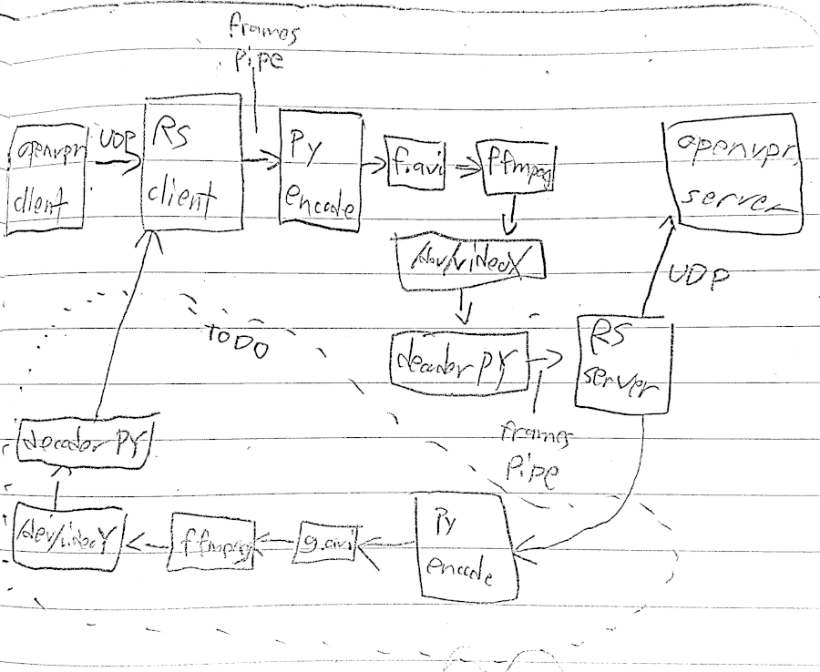

## What's this?

Experimental hackathon code. Tunnel OpenVPN through video formats with arbitrary compression + encoding.



## How to

1. Setup OpenVPN client + server
2. Configure OpenVPN client to connect to localhost:50272 instead of openvpn server
3. Start the client-side.

```
<window 1>
# listen for openvpn packets and encode to video
cargo run client | python encoder.py f.avi
```

```
<window 2>
# create a fake webcam feed via kernel module
sudo modprobe v4l2loopback
# might not be /dev/video2: check before/after modprobe to see which one was added
ffmpeg -re -i f.avi -vcodec rawvideo -pix_fmt rgb24 -f v4l2 /dev/video2
```

4. Start the server-side.

```
<window 2>
# read from webcam feed, decode original UDP packets from openvpn client, and send them to openvpn server.
# 127.0.0.1:1194 is the openvpn server url
# the first argument for decoder.py is X from /dev/videoX
{while true; do python decoder.py 2 10240 || break; done} | cargo run server 127.0.0.1:1194
```
